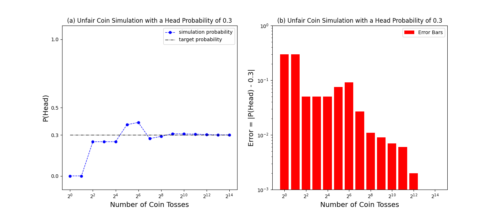

- ---

- __Author__: Soheil Esmaeilzadeh
- __Created on__: 08/08/2021
- __Email__: [soes@alumni.stanford.edu](mailto:soes@alumni.stanford.edu)
  
- ---

# Unfair Coin from Fair Coin

<p align="center">
  
</p>
<p align="center">  
<em> <font size="-10">photo courtesy of Flickr user @MagnuMicah</font> </em>
</p>

### Problem Definition:

Imagine you are given a coin for which the probability of getting Heads (`1`) or Tails (`0`) are equal, i.e., 

<p align="center">

</p>

In this case, the coin is usually referred to as a __fair coin__.  Now imagine that you are asked to build a coin for which such a probability favors Heads over Tails or vice versa, i.e., 

<p align="center">

</p>

In this case, the coin is usually referred to as an __unfair coin__. An unfair coin is biased towards Heads if the probability of getting Heads is higher, and is biased towards Tails if the probability of getting Tails is higher.

Now, imagine that given a function that simulates the outcome of a __fair__ coin toss (i.e., equal probabilities of getting Heads or Tails) we want to write another function that can simulate the outcome of an __unfair__ coin toss for which the probability of getting Heads is for instance `0.3`.

<!-- <p align="center">

</p> -->

### Approach:

We first define the function `fair_coin_single_toss` that represents the outcome of a single toss for a __fair __coin as:

```
def fair_coin_single_toss():

    '''
    A function for simulating a single toss of a fair coin (i.e., equal head/tail probabilities)
    Parameters
    ----------
    None

    Returns
    -------
    fair_coin_single_toss_outcome: int
        a randomly generated integer with an equally probable value of 0 or 1 corresponding to tail or head outcomes
    '''

    fair_coin_single_toss_outcome = random.randint(0,1)
    
    return fair_coin_single_toss_outcome
```

In order to generate a sequence of __fair__ coin tosses, next we define the function `fair_coin_toss_sequence` which for `n` attempts generates a sequence of __fair__ coin toss scenarios using the already defined function `fair_coin_single_toss` as:
```
def fair_coin_toss_sequence(n=3):

    '''
    A function for simulating tossing a sequence of fair coins
    Parameters
    ----------
    n: int
        number of times a fair coin is tossed

    Returns
    -------
    toss_sequence: string
        a string of '1's and '0' for the times the fair coin comes out head or tail
        e.g., a sequence of 3 as 'head'-'tail'-'head' would be '101'
    '''

    fair_coin_toss_sequence_outcome = "".join([str(fair_coin_single_toss()) for i in range(n)])

    return fair_coin_toss_sequence_outcome

```

Finally, we define the `unfair_coin` function that simulates the outcome of an __unfair__ coin toss for which the probability of getting Heads is for instance `0.3`. 

The approach that we use here is as follows:
- Suppose you need to simulate an unfair coin that has a probability of `1/4 = 0.25` for getting Heads. You can easily do that by flipping the fair coin twice. Report success (`1`) if you get 2 Heads, and report failure (`0`) otherwise. 
- In a slightly more complex scenario, suppose that you need to simulate an unfair coin that has a probability of `1/3 = 0.33` for getting Heads. Since the denominator `3` is not a power of `2`, this may seem a bit complicated, but there is an easy solution. Flip the fair coin twice and report success (`1`) on `11 (HH)`, and report failure (`0`) on `10 (HT)` or `01 (TH)`, and try again on `00 (TT)`.
- Now suppose that you need to simulate an unfair coin that has a probability of `1/100 = 0.01` for getting Heads, this may seem even more complicated, but there is again an easy solution. First, we need `Ceil[log2(100)] = 7` fair coin flips to get enough outcomes, then we label one sequence of outcomes as success (`1`) and `100 - 1 = 99` arbitrarily chosen sequences as failure (`0`), and all other sequences as a `retry`.
  - For our particular example where the probability of getting Heads is `0.3` we consider `Ceil[log2(10)] = 4` fair coin flips, then we label `3` sequences of outcomes as success (`1`) and `10 - 3 = 7` arbitrarily chosen sequences as failure (`0`), and all other sequences as a `retry`. In the `unfair_coin` function, the sequence `s1` represents the `3` sequences of outcomes that we designate as `1` and the sequence `s0` represents the `7` arbitrarily chosen sequences that we designate as `0`.
  
```
def unfair_coin(s0, s1):

    '''
    A function for simulating tossing an unfair coin
    Parameters
    ----------
    s0: list[strings]
        fair coin toss sequence outcomes for which we return 0
    s1: list[strings]
        fair coin toss sequence outcomes for which we return 1

    Note:
    ----------
        for fair coin toss sequence outcomes outside of s0 or s1 we redo the 'fair_coin_toss_sequence'

    Returns
    -------
    unfair_coin_outcome: int
        0 for fair coin toss sequence outcomes that are in s0
        1 for fair coin toss sequence outcomes that are in s1
        retry for fair coin toss sequence outcomes that are NOT in s1 or s0
    '''

    while True:

        # get a sequence of fair coin tosses
        num = fair_coin_toss_sequence(n=len(s1[0]))

        # return 1
        if num in s1: 
            unfair_coin_outcome = 1 
            return unfair_coin_outcome

        # return 0
        elif num in s0:
            unfair_coin_outcome = 0 
            return unfair_coin_outcome
            
        # RE-try
        else:
            continue 
```

### Run the Code:

From the command line, run the `requirements.sh` bash script which first creates a virtual environment and then installs the packages that are used in the main code script: 
```
>> source requirements.sh
```

Afterwards, run the main code script `unfair-coin.py`:

```
>> python unfair-coin.py
```

### Results: 

Figure (a) shows the probability of getting Heads for an unfair coin as a function of the number of coin tosses in a log2 scale. Figure (b) shows a bar chart for the point error values of the Head probabilities as a function of the number of coin tosses in a log2 scale. We define the point error value as the absolute difference between the nominal Heads probability (i.e., `0.3`) and the Heads probability that is obtained through the simulation at each point in the tossing sequence.
We can see that as the number of coin tosses increases, the probability of getting Heads converges to its nominal value of `0.3` (considered in this example), and the point error approaches to a value of `0.0`.

<p align="center">
  
</p>


---

### Directory Layout: 
```
├── README.md
├── images
│   └── unfair_coin.jpeg
├── outputs
│   ├── logs.txt
│   └── simulation-results.png
├── requirements.sh
└── unfair-coin.py
```
